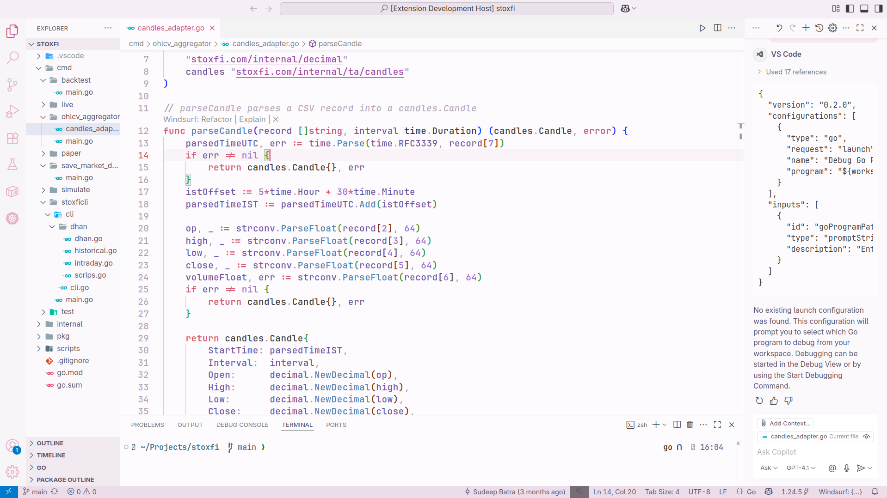
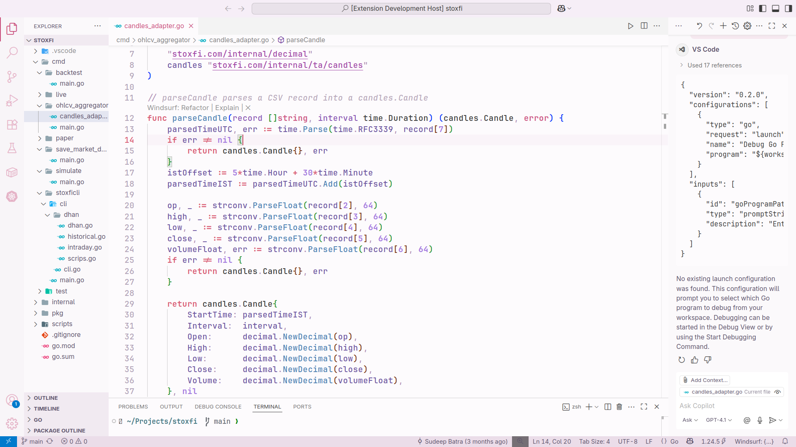
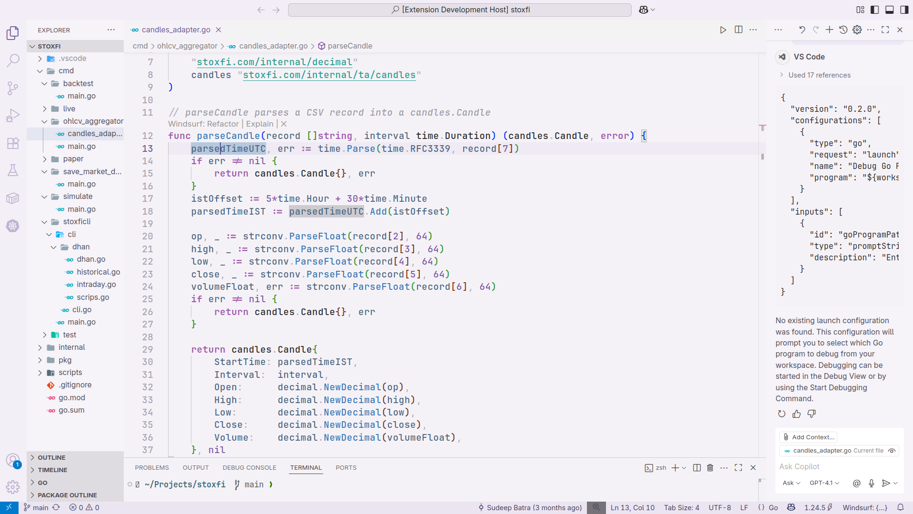
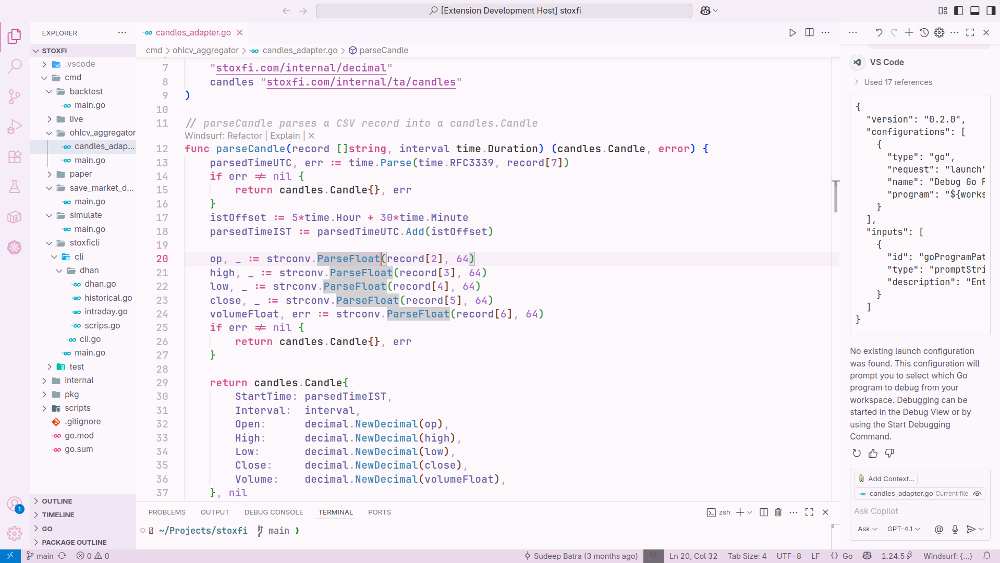
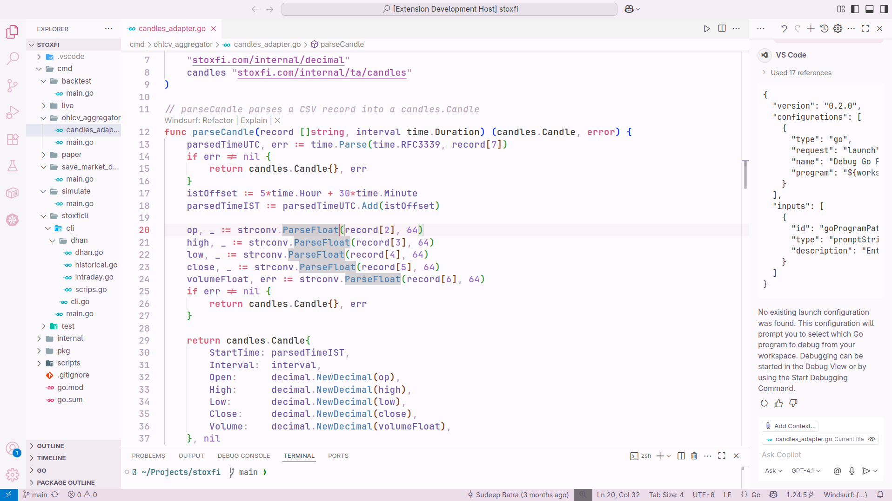

# PastelLight — Soft & Elegant Light Themes for VS Code ✨

A collection of calming, pastel-toned light themes for Visual Studio Code.  
Crafted to evoke clarity, warmth, and visual comfort — perfect for developers who prefer elegant light themes over harsh contrasts.

---

## 🌈 Included Themes

- 🌸 **Blush Drift** – A soft pink-hued palette for serene focus.
- 🌷 **Lilac Dream** – Gentle purples that soothe and balance.
- ❄️ **Lilac Frost** – Cool lilac tones with frosty freshness.
- 🌿 **Petal Whisper** – Subtle floral tones with light greens and blushes.
- 🌹 **Roseveil** – Romantic rose hues with a refined contrast.

---

## 📸 Preview

  
  
  
  

---

## 🗂 What's in the folder

- `package.json` – Manifest file defining theme metadata and paths.
- `themes/*.json` – The color theme definition files.
- `icons/icon.png` – Extension icon.
- `screenshots/` – Theme preview images.

---

## 🚀 Get up and running

- Press `F5` to open a new VS Code window with your theme extension loaded.
- Open `File > Preferences > Color Themes` and pick your favorite from the PastelLight collection.
- To inspect syntax scopes, use `Inspect TM Scopes` (`Ctrl+Shift+P` or `Cmd+Shift+P`).

---

## 🛠 Make Changes

Edits to any theme JSON files will be reflected live in the Extension Development Host window when saved.

---

## 📦 Install your extension

To use it outside dev mode:

1. Package your extension using [`vsce`](https://code.visualstudio.com/api/working-with-extensions/publishing-extension).
2. Copy the `.vsix` file into your system or install via the Extensions sidebar in VS Code.

---

📥 [Recommended VSCode Settings](./recommended/pastellight-recommended-settings.json)

---

Crafted with 🩷 by [Sudeep Batra](https://github.com/sudeepbatra)
